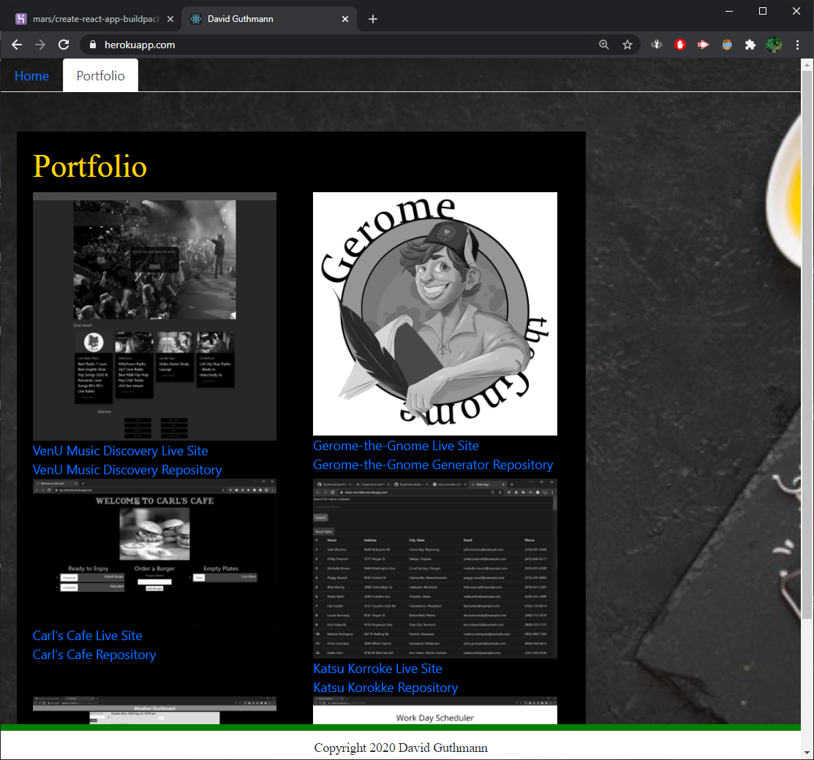

# portfolio-2020-react
### Author: David Guthmann

github: https://github.com/Dguthmann/  
livesite: https://portfolio-2020-react.herokuapp.com/

## List of Contents

debug.log  
package.json  
package-lock.json  
README.md  
### public  
favicon.ico    
index.html    
logo192.png  
logo192.png  
manifest.json  
robots.txt  
#### images
dguthmann.png  
gerome-logo_readme.png  
katsu-screenshot.png  
pwgss.png  
screenshotindex.png  
screenshotport.png  
vacass.png  
venuss.png  
worscss.png  
#### other
DavidGuthmann-Resume.pdf  
### src  
App.js  
App.test.js  
App.css  
index.css  
index.js  
#### components  
Footer.js  
NavTabs.js  
Project.js  
##### pages  
About.js  
Portfolio.js  
Search.js  

## Installation
you will need the following additional npms to run this project:  
bootstrap  
react  
react-dom  
react-scripts  
reactstrap  
web-vitals  

## Basic Overview of Project

This is an update to the second portfolio page I've created using html and css.  
This is updated to use the react framework.  

## Screenshot of Website

  
  

## Resources Used

bootstrap for the javascript employed and some of the css  
Freepick.com for background cheese, which is more a personal touch.  

## Further Development Plans

Changing out projects for more complex and defining ones, altering how things are generated on page as knowledge increases

## Changelog

2020-11-11: Bug Fixing ReadME updates  
2020-11-10: Basic Updates to React Format  
2020-10-27: Adding of Gerome the Gnome NPC character creator to highlighted projects
2020-09-29: Adding of personal information, links and screenshots of projects on the portfolio page, links to my github, linkedin, and a pdf of my resume  
2020-09-09: Addition of more comments to the file, and writing of README  
2020-09-08: Bug Fixing mainly of the footer, and the projects of the portfolio page staying within their container  
2020-09-07: Creation of files, the majority of coding, and first deployment

## Getting Started with Create React App

This project was bootstrapped with [Create React App](https://github.com/facebook/create-react-app).

## Available Scripts

In the project directory, you can run:

### `npm start`

Runs the app in the development mode.\
Open [http://localhost:3000](http://localhost:3000) to view it in the browser.

The page will reload if you make edits.\
You will also see any lint errors in the console.

### `npm test`

Launches the test runner in the interactive watch mode.\
See the section about [running tests](https://facebook.github.io/create-react-app/docs/running-tests) for more information.

### `npm run build`

Builds the app for production to the `build` folder.\
It correctly bundles React in production mode and optimizes the build for the best performance.

The build is minified and the filenames include the hashes.\
Your app is ready to be deployed!

See the section about [deployment](https://facebook.github.io/create-react-app/docs/deployment) for more information.

### `npm run eject`

**Note: this is a one-way operation. Once you `eject`, you can’t go back!**

If you aren’t satisfied with the build tool and configuration choices, you can `eject` at any time. This command will remove the single build dependency from your project.

Instead, it will copy all the configuration files and the transitive dependencies (webpack, Babel, ESLint, etc) right into your project so you have full control over them. All of the commands except `eject` will still work, but they will point to the copied scripts so you can tweak them. At this point you’re on your own.

You don’t have to ever use `eject`. The curated feature set is suitable for small and middle deployments, and you shouldn’t feel obligated to use this feature. However we understand that this tool wouldn’t be useful if you couldn’t customize it when you are ready for it.

## Learn More

You can learn more in the [Create React App documentation](https://facebook.github.io/create-react-app/docs/getting-started).

To learn React, check out the [React documentation](https://reactjs.org/).

### Code Splitting

This section has moved here: [https://facebook.github.io/create-react-app/docs/code-splitting](https://facebook.github.io/create-react-app/docs/code-splitting)

### Analyzing the Bundle Size

This section has moved here: [https://facebook.github.io/create-react-app/docs/analyzing-the-bundle-size](https://facebook.github.io/create-react-app/docs/analyzing-the-bundle-size)

### Making a Progressive Web App

This section has moved here: [https://facebook.github.io/create-react-app/docs/making-a-progressive-web-app](https://facebook.github.io/create-react-app/docs/making-a-progressive-web-app)

### Advanced Configuration

This section has moved here: [https://facebook.github.io/create-react-app/docs/advanced-configuration](https://facebook.github.io/create-react-app/docs/advanced-configuration)

### Deployment

This section has moved here: [https://facebook.github.io/create-react-app/docs/deployment](https://facebook.github.io/create-react-app/docs/deployment)

### `npm run build` fails to minify

This section has moved here: [https://facebook.github.io/create-react-app/docs/troubleshooting#npm-run-build-fails-to-minify](https://facebook.github.io/create-react-app/docs/troubleshooting#npm-run-build-fails-to-minify)
